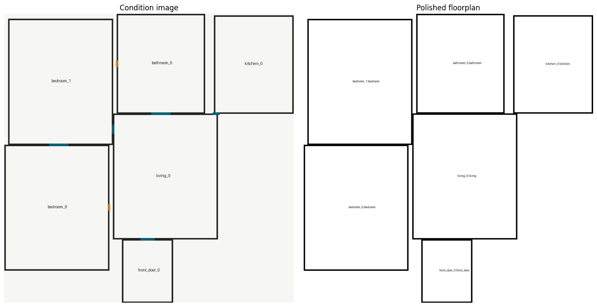
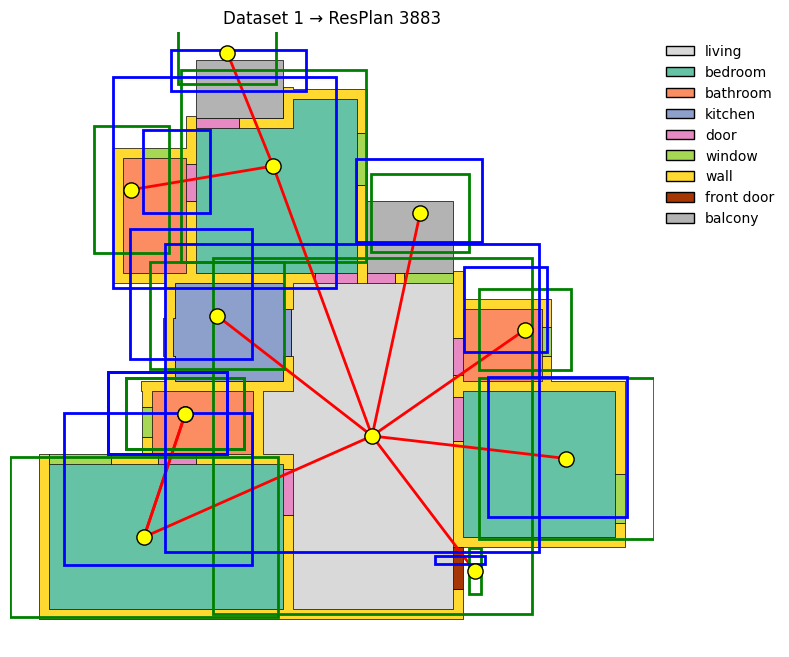
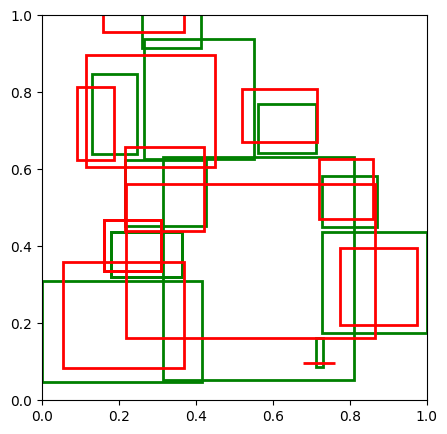
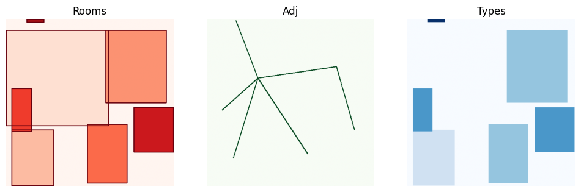

# FloorPlan-Pipeline

End-to-end system that converts **natural language descriptions** into **structured floorplan graphs with predicted spatial layouts and architectural renderings**.

---

## Visual Overview

### Final Output: Stable Diffusion + ControlNet Floorplan


*Architectural floorplan generated from predicted layout boxes using Stable Diffusion v1.5 with ControlNet segmentation conditioning.*

### Topological Graph on Real Floorplan


*Room-adjacency graph (red edges, yellow nodes) overlaid on ground-truth ResPlan floorplan. Each edge encodes a spatial relationship (adjacency, via_door, direct).*

### Layout Prediction: Ground Truth vs. Predicted Boxes


*Green boxes = ground truth room positions. Red boxes = GNN-predicted layouts [cx, cy, w, h] per room. The RoughLayoutGNN was trained on 100 ResPlan floorplans.*

### Control Image Channels for Diffusion


*Three-channel control image fed to ControlNet: Rooms (Red), Adjacency lines (Green), Room types (Blue). The diffusion model uses these as conditioning signals.*

---

## Pipeline Overview

```
User Prompt ──→ LLM Expansion ──→ Edge Extraction ──→ Graph Generation ──→ Edge Completion (GNN)
                                                                                  │
                                                                                  ▼
          Floorplan Rasterization ←── Stable Diffusion + ControlNet ←── Layout Prediction (GNN)
```

| Stage | Module | Description |
|---|---|---|
| 1. Prompt Expansion | `prompt_expander.py` | LLM expands natural language into a complete set of room types with reasoning and spatial context |
| 2. Edge Extraction | `edge_extractor.py` | LLM extracts only explicitly stated room-to-room relationships from the user prompt |
| 3. Graph Generation | `graph_generator.py` | LLM generates a canonical graph (nodes + edges) in deterministic text format |
| 4. Edge Completion | `edge_completion.py` | Trained GNN predicts missing edges, ensuring topological validity and connectivity |
| 5. Geometry Inference | `complete_workflow.ipynb` | Sentence-transformer prompt embedding + dataset-calibrated priors → area, centroid, bbox per room |
| 6. Layout Prediction | `model_testing.ipynb` | RoughLayoutGNN (3× GINEConv + MLP head) predicts 4D room boxes [cx, cy, w, h] |
| 7. Rasterization | `rough_layout_to_floorplan.ipynb` | Stable Diffusion + ControlNet converts predicted layouts into architectural images |

---

## Step-by-Step Walkthrough

The notebook [`complete_workflow.ipynb`](complete_workflow.ipynb) demonstrates the full pipeline.

### Step 1: Prompt Expansion

```python
prompt = "A compact 2BHK apartment with a living room, a kitchen next to the living room,
           two bedrooms, one bathroom, and a front door connected to the living area."

expanded = workflow.expand_prompt(prompt)
# Original rooms: ['living', 'kitchen', 'bedroom', 'bathroom', 'front_door']
# Added rooms:  []
# All rooms:    ['living', 'kitchen', 'bedroom', 'bathroom', 'front_door']
```

The LLM identifies that all essential rooms are present and no additions are needed. The spatial context is captured: *"The layout suggests a compact, efficient design where the living room acts as the central hub..."*

### Step 2: Explicit Edge Extraction

```python
extracted_edges = workflow.extract_explicit_edges(sample_prompt, expanded)
# Extracted explicit edges:
#   - kitchen -> living (relation: adjacency)
#   - front_door -> living (relation: connected_to)
```

Only relationships explicitly stated by the user are extracted — no inference.

### Step 3: Graph Generation

```python
graph_schema = workflow.generate_graph(expanded, sample_prompt, extracted_edges)
# Rooms:  bedroom_0, bedroom_1, bathroom_0, front_door_0, kitchen_0, living_0
# Edges:  living_0 adjacency kitchen_0, front_door_0 connected_to living_0
```

The canonical graph is generated: 6 rooms, 2 explicit edges. The output is serialized into the canonical text format used as ground truth.

### Step 4: Learned Edge Completion

A trained `EdgeCompletionGNN` sweeps threshold × max-edges to probabilistically add missing but plausible edges (bedroom–living, bathroom–bedroom, bedroom–bedroom). Result:

```
# Before completion: 2 edges
# After completion:  7 edges
# Edges added:       5
```

A domain-validity and connectivity guarantee ensures every graph is fully connected with architecturally sensible relationships.

### Step 5: Geometry Inference

Sentence-transformers (`all-MiniLM-L6-v2`) encode the user prompt into a 64-dimensional embedding. Dataset-calibrated priors (area, aspect ratio, centroid) are combined with graph-topology-aware directional relaxation and de-overlap passes to assign `area`, `centroid`, and `bbox` to each node.

```
# Node feature matrix shape: (6, 11)
# Edge index shape: (2, 14)
# Edge feature matrix shape: (14, 10)
```

Output visualization:

*See the NetworkX graph plot in `complete_workflow.ipynb` Cell 21 — the numeric graph is visualized with spring layout, color-coded by room type (living=blue, bedroom=green, bathroom=orange, kitchen=lime).*

### Step 6: Layout Prediction

The `RoughLayoutGNN` (trained in [`model_testing.ipynb`](model_notebook_training/model_testing.ipynb)) takes the numeric graph and predicts 4D bounding boxes per room.

```python
# RoughLayoutGNN(
#   (conv1): GINEConv(nn=Sequential(
#     (0): Linear(in_features=11, out_features=128)
#     (1): ReLU()
#     (2): Linear(in_features=128, out_features=128)))
#   (conv2): GINEConv(...)
#   (conv3): GINEConv(...)
#   (head): Sequential(Linear(128→128), ReLU(), Linear(128→4))
# )
```

The model is loaded from `best_model.pt` and infers normalized room coordinates in a single forward pass.

### Step 7: Floorplan Rasterization

The predicted layout boxes are converted to RGB control images (`graph_layout_to_rgb`) and fed through **Stable Diffusion v1.5** with a **ControlNet** (`control_v11p_sd15_seg`) conditioned on room segmentation, adjacency lines, and room types:

```python
prompt = "clean architectural floor plan, thin black walls, white background,
          rooms separated by walls, door openings between adjacent rooms,
          2d blueprint, line drawing"
result = pipe(prompt=prompt, image=control_pil, num_inference_steps=40, ...).images[0]
```

*See the output in `rough_layout_to_floorplan.ipynb` Cells 20–27 — the control image (Rooms/Adj/Types channels) and final generated floorplan are displayed side by side.*

---

## Project Structure

```
FloorPlan-Pipeline/
├── README.md
├── LICENSE                                  # GNU GPL v3
├── requirements.txt
├── best_model.pt                            # Pre-trained RoughLayoutGNN
├── .env
│
├── complete_workflow.ipynb                  # End-to-end pipeline (text → floorplan)
│
├── text_to_graph/                           # LLM-based text → graph
│   ├── __init__.py
│   ├── schemas.py                           # Pydantic: FloorplanRoom, FloorplanEdge
│   ├── prompt_expander.py                   # Expands user prompt into room list
│   ├── edge_extractor.py                    # Extracts explicit edges from prompt
│   ├── graph_generator.py                   # Generates canonical graph text
│   ├── edge_completion.py                   # GNN predicts missing edges
│   ├── workflow.py                          # Orchestrator: FloorplanWorkflow
│   └── example.py                           # Interactive CLI demo
│
├── graphs/                                  # Graph data layer
│   ├── schema.py                            # RoomNode, RoomEdge, FloorplanGraph
│   ├── numerical_graph.py                   # Graph → (x, edge_index, edge_attr) tensors
│   └── for_resplan/                         # ResPlan dataset adapters
│       ├── resplan_adapter.py
│       └── serialize_graph.py               # Deterministic canonical serialization
│
├── dataset/
│   ├── resplan_utils.py                     # Plotting, graph-from-plan, geometry utils
│   └── (ResPlan.pkl)                        # External dataset
│
├── scripts/
│   ├── build_numeric_dataset.py             # Build numeric tensors from ResPlan
│   ├── build_numeric_subset.py              # Build 100-sample subset
│   └── train_edge_completion.py             # Train EdgeCompletionGNN
│
├── model_notebook_training/
│   ├── model_testing.ipynb                  # RoughLayoutGNN training + eval
│   └── rough_layout_to_floorplan.ipynb      # Layout → Stable Diffusion rasterization
│
├── tests/
│   ├── test_text_to_graph.py
│   ├── test_resplan_graph.py
│   └── test_resplan_graph_serialization.py
│
└── trained_models/                          # Edge completion checkpoint directory
```

---

## Key Components

### `FloorplanWorkflow` (`text_to_graph/workflow.py`)

Main orchestrator combining all text-to-graph stages:

| Method | Purpose |
|---|---|
| `expand_prompt(prompt)` | LLM call → `ExpandedPrompt` with room lists and spatial context |
| `extract_explicit_edges(prompt, expanded)` | LLM call → `ExplicitEdgeExtraction` |
| `generate_graph(expanded, prompt, extracted_edges)` | LLM call → `FloorplanGraphSchema`, filtered to explicit edges |
| `run(user_prompt)` | Full pipeline → `FloorplanGraph` |
| `run_with_text_output(user_prompt)` | Full pipeline → `(serialized_text, FloorplanGraph)` |

### `RoughLayoutGNN` (`model_testing.ipynb`)

```
Node features (11D) + Edge features (10D)
    → GINEConv₁ (11→128) → ReLU
    → GINEConv₂ (128→128) → ReLU
    → GINEConv₃ (128→128) → ReLU
    → MLP head (128→128→4)
    → [cx, cy, w, h] per room
```

**Input:** Node features = [6D one-hot room type | area ratio | cx, cy | w, h], Edge features = [3D relation | dx, dy, dist | 4D direction]

**Output:** Normalized [0, 1] bounding boxes — center x, center y, width, height

### `EdgeCompletionGNN` (`text_to_graph/edge_completion.py`)

A 3-layer GINEConv + pairwise MLP head. Trained with binary cross-entropy to predict which node pairs should be connected and what edge type they should have. Provides:
- Convex hull complement recommendation set
- Probabilistic selection with connectivity guarantee
- Degree-capped topological validity fallback

---

## Getting Started

### Prerequisites

- Python 3.10+
- LLM API key (NVIDIA AI Endpoints or OpenAI-compatible)
- CUDA-compatible GPU (recommended for SD rasterization)

### Installation

```bash
git clone <repository-url> && cd FloorPlan-Pipeline
python -m venv venv && source venv/bin/activate
pip install -r requirements.txt
```

**Environment variables** (`.env`):

```bash
api_key=nvapi-...         # NVIDIA API key
OPENAI_BASE_URL=https://integrate.api.nvidia.com/v1
FLOORPLAN_LLM_MODEL=mistralai/mistral-small-4-119b-2603
```

### Quick Start

**Interactive CLI:**
```bash
python text_to_graph/example.py
```

**Full notebook:**
```bash
jupyter notebook complete_workflow.ipynb
```

**Python API:**
```python
from text_to_graph.workflow import FloorplanWorkflow
from dotenv import load_dotenv
import os

load_dotenv()
workflow = FloorplanWorkflow(
    api_key=os.getenv("api_key"),
    model="mistralai/mistral-small-4-119b-2603",
    base_url="https://integrate.api.nvidia.com/v1"
)

graph = workflow.run("A compact 2BHK apartment with a living room...")
print(f"Nodes: {len(graph.nodes)}, Edges: {len(graph.edges)}")
```

### Training

**Train Edge Completion GNN:**
```bash
python scripts/build_numeric_dataset.py    # Build numeric dataset first
python scripts/train_edge_completion.py --dataset dataset/resplan_numeric.npz
```

**Train Layout GNN:** Follow the cells in [`model_testing.ipynb`](model_notebook_training/model_testing.ipynb) — dataset construction → train/test split → training with composite loss → early stopping → export.

---

## Room Vocabulary

| Type | Description |
|---|---|
| `living` | Living room, main gathering space |
| `kitchen` | Kitchen / cooking area |
| `bedroom` | Bedroom |
| `bathroom` | Bathroom |
| `balcony` | Balcony / outdoor space |
| `front_door` | Entry / exit point |
| `dining` | Dedicated dining room |

**Relations:** `adjacency`, `via_door`, `direct`

**Directions:** `left_of`, `right_of`, `above`, `below`

---

## Configuration

| Env Variable | Default | Description |
|---|---|---|
| `api_key` / `NVIDIA_API_KEY` | — | LLM API key |
| `FLOORPLAN_LLM_MODEL` | `mistralai/mistral-small-4-119b-2603` | LLM model name |
| `OPENAI_BASE_URL` | `https://integrate.api.nvidia.com/v1` | API endpoint |
| `EDGE_COMPLETION_MODEL_PATH` | `trained_models/best_edge_completion.pt` | Edge completion checkpoint |
| `EDGE_COMPLETION_THRESHOLD` | `0.30` | Edge prediction confidence threshold |
| `EDGE_COMPLETION_MAX_ADDED` | `24` | Max edges to add during completion |

---

## Testing

```bash
python -m pytest tests/ -v
```

---

## Notebook Reference

| Notebook | Description | Key Outputs |
|---|---|---|
| [`complete_workflow.ipynb`](complete_workflow.ipynb) | End-to-end: text → graph → geometry → layout | Canonical serialization, NetworkX graph visualization, node feature matrix |
| [`model_testing.ipynb`](model_notebook_training/model_testing.ipynb) | RoughLayoutGNN training + evaluation | Training loss curves, GT-vs-pred box overlays on ResPlan floorplans, predicted layout plots |
| [`rough_layout_to_floorplan.ipynb`](model_notebook_training/rough_layout_to_floorplan.ipynb) | Layout → Stable Diffusion rasterization | Control image channels (Rooms/Adjacency/Types), SD + ControlNet generated floorplan images |

---

## License

GNU General Public License v3 — see [LICENSE](LICENSE).

## Status

**Topology pipeline** (text → graph → edge completion): Complete.  
**Geometry inference** (graph → numeric tensors): Complete.  
**Layout prediction** (numeric tensors → room boxes): Complete.  
**Rasterization** (boxes → floorplan image): Complete (Stable Diffusion + ControlNet).

**Downstream work:** Polygon-based layout refinement (`PolygonRefineGNN` — in progress), multi-floor support, 3D extrusion.
